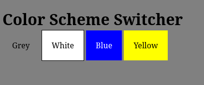
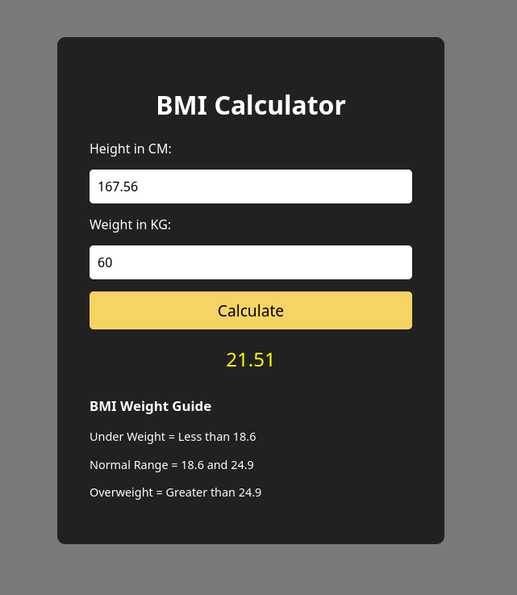
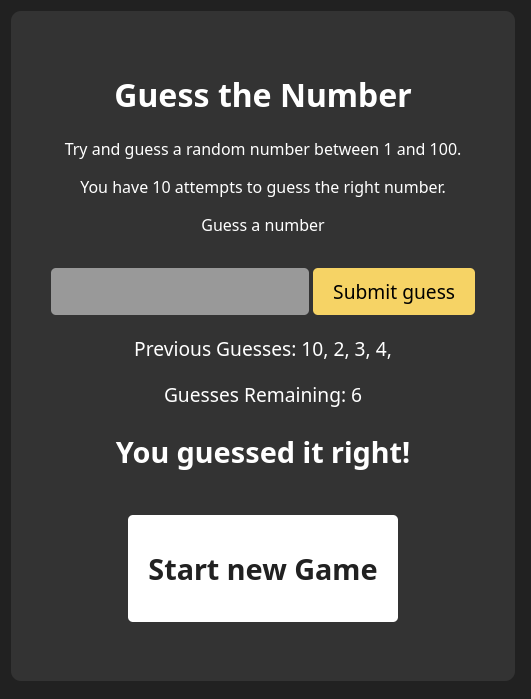

# JavaScript Learning (Beginner and Advanced)

## NOTE

For Advance JS, The codes are in the Adv-JS folder while the notes are here in the bottom

# JavaScript Interactive Demos  (Part-01)

This repository contains small, interactive JavaScript projects built to demonstrate fundamental and intermediate programming concepts. 

## 🚀 Projects Included

1. **Color Scheme Switcher:** Demonstrates DOM manipulation by changing the webpage's background color based on user interaction with different elements.

2. **BMI Calculator:** A functional calculator that takes user input, performs mathematical logic, and dynamically displays the result on the screen.

3. **Digital Clock:** Uses global scope variables and `setInterval` to create a live, updating clock on the page.

4. **Guess the Number:** A full mini-game that generates random numbers, tracks previous guesses via arrays, utilizes conditional logic for game states, and creates new UI elements upon game completion.

# Advanced JavaScript  (Part-02)

**Prototype Chain**
The Prototype Chain is used for Inheritence in JS, in prototype chain When you try to access a property or method on an object, it first checks the object itself, 
if it doesn't find it, it looks at the object's prototype, 
it continues up this "chain" until it finds the property or reaches the end of the chain

**ES6+ Syntax**
They are the modern features in JS like the arrow function

**Generators & Iterators**
Iterators are objects that define a sequence and potentially a return value upon completion, implementing a next() method
Generators are functions that can be paused and resumed, yielding multiple values over time

**ES Modules vs CommonJS**
1. CommonJS
Syntax: `require()` and `module.exports`
Behavior: Synchronous loading. It loads the module entirely on that line before moving on.
Use Case: Standard for older Node.js backend development
Not used in modern browsers

3. ES Modules
Syntax: `import` and `export`
Behavior: Asynchronous/Static loading. The JS engine parses imports before executing the code,
Use Case: Standard in modern front-end and newer Node environments
Often used in the Modern Browsers
